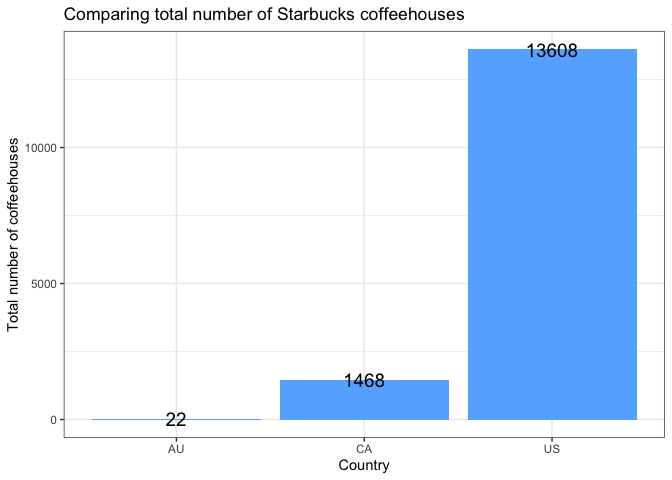

<!-- README.md is generated from README.Rmd. Please edit that file -->

# explosbuck

<!-- badges: start -->
<!-- badges: end -->

The goal of explosbuck is to explore the Starbucks coffeehouses data and
compare the coffeehouses in countries.

<https://github.com/xxuu0086/R-Package-Project>

## Installation

You can install the development version of explosbuck from
[GitHub](https://github.com/xxuu0086/R-Package-Project) with:

``` r
# install.packages("devtools")
devtools::install_github("xxuu0086/explosbuck")
```

## Usage

``` r
library(explosbuck)
```

## Examples

``` r
library(knitr)
```

To access Starbucks data, for first six rows:

``` r
head(starbucks) %>%
  kable()
```

| Brand     | Store Number | Store Name               | Ownership Type | Street Address                  | City             | State/Province | Country | Postcode | Phone Number | Timezone                | Longitude | Latitude |
|:----------|:-------------|:-------------------------|:---------------|:--------------------------------|:-----------------|:---------------|:--------|:---------|:-------------|:------------------------|----------:|---------:|
| Starbucks | 47370-257954 | Meritxell, 96            | Licensed       | Av. Meritxell, 96               | Andorra la Vella | 7              | AD      | AD500    | 376818720    | GMT+1:00 Europe/Andorra |      1.53 |    42.51 |
| Starbucks | 22331-212325 | Ajman Drive Thru         | Licensed       | 1 Street 69, Al Jarf            | Ajman            | AJ             | AE      | NA       | NA           | GMT+04:00 Asia/Dubai    |     55.47 |    25.42 |
| Starbucks | 47089-256771 | Dana Mall                | Licensed       | Sheikh Khalifa Bin Zayed St.    | Ajman            | AJ             | AE      | NA       | NA           | GMT+04:00 Asia/Dubai    |     55.47 |    25.39 |
| Starbucks | 22126-218024 | Twofour 54               | Licensed       | Al Salam Street                 | Abu Dhabi        | AZ             | AE      | NA       | NA           | GMT+04:00 Asia/Dubai    |     54.38 |    24.48 |
| Starbucks | 17127-178586 | Al Ain Tower             | Licensed       | Khaldiya Area, Abu Dhabi Island | Abu Dhabi        | AZ             | AE      | NA       | NA           | GMT+04:00 Asia/Dubai    |     54.54 |    24.51 |
| Starbucks | 17688-182164 | Dalma Mall, Ground Floor | Licensed       | Dalma Mall, Mussafah            | Abu Dhabi        | AZ             | AE      | NA       | NA           | GMT+04:00 Asia/Dubai    |     54.49 |    24.40 |

To find two letter combination country code, for first six rows:

``` r
head(ISOcode) %>%
  kable()
```

| Country_code | Country              |
|:-------------|:---------------------|
| AD           | Andorra              |
| AE           | United Arab Emirates |
| AR           | Argentina            |
| AT           | Austria              |
| AU           | Australia            |
| AW           | Aruba                |

To count total number of Starbucks coffeehouses in Australia:

``` r
# Use ISOcode to find the code for Australia is AU
# filter(ISOcode, Country == "Australia")
count_sbuck(code = "AU") %>%
  kable()
```

| country | total |
|:--------|------:|
| AU      |    22 |

To see difference in total number of Starbucks coffeehouses between
Australia and United States:

``` r
diff_sbuck(code1 = "AU", code2 = "US") %>%
  kable()
```

|     x |
|------:|
| 13586 |

A plot to compare the total number of coffeehouses for Australia, United
States and Canada:

``` r
plot_sbuck(code = c("AU", "US", "CA"))
```


